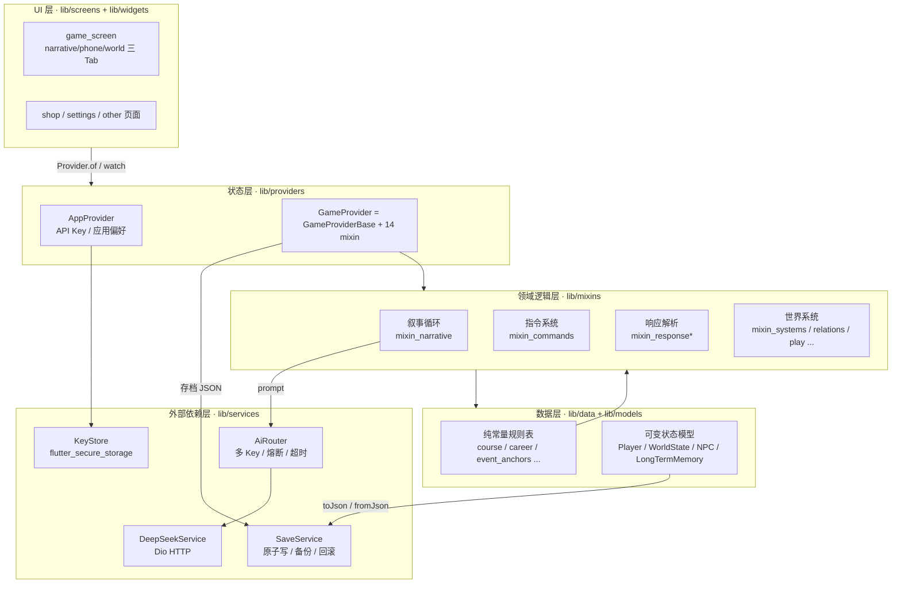
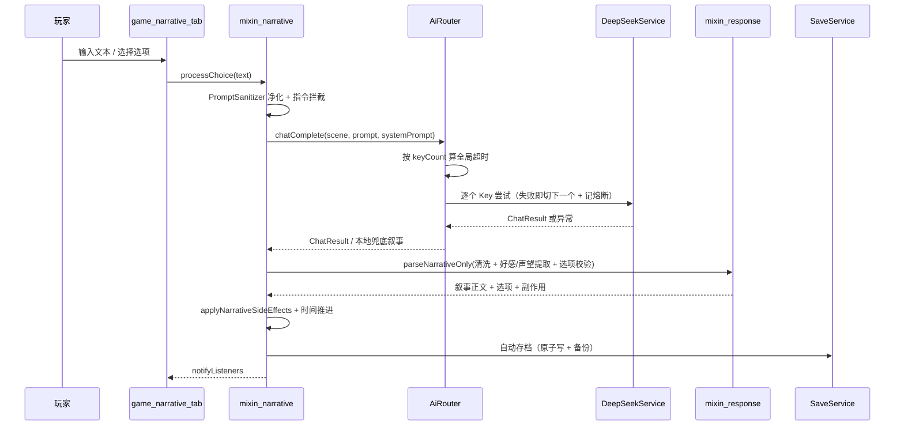

# 架构文档 · Hogwarts Life Simulator

> **DOC2**：补齐审查报告 v3 指出的「无架构决策记录（ADR）、无架构概览图」。
> 面向刚接手项目的人：先看图与分层，再看 §3 的架构决策记录（ADR），
> 能理解「为什么现在是这个样子」，避免把历史坑重踩一遍。
>
> 日常按文件定位问题请读根目录 [`PROJECT_GUIDE.md`](../PROJECT_GUIDE.md)（目录地图 / 症状速查）；
> 本文是它的补充，讲**结构决策**而不是文件清单。

---

## 1. 架构全景

**四条依赖方向铁律**（违反即架构腐化）：

1. **UI 不直接碰 services** —— 需要数据就 `watch` Provider，不要在页面里 `AiRouter(...)`。
2. **mixin 之间不互相 import** —— 跨 mixin 调用一律在 `game_provider_base.dart` 声明抽象方法，
   由具体 mixin 实现（原因见 ADR-001）。
3. **`lib/data/` 保持纯常量** —— 不放状态、不放业务逻辑；需要动态计算就上移到 mixin。
4. **模型 `fromJson` 必须给老档缺省值** —— 见 ADR-005。

---

## 2. 分层职责

| 层 | 目录 | 职责 | 不该出现的东西 |
|---|---|---|---|
| UI | `screens/`、`widgets/` | 渲染、手势、页面内局部状态 | 业务规则、JSON 解析、AI 调用 |
| 状态 | `providers/` | 持有可变状态、通知重建 | 具体业务算法（放 mixin） |
| 领域逻辑 | `mixins/` | 叙事循环、指令、解析、世界推进 | `BuildContext`、Widget |
| 数据 | `data/`、`models/` | 规则常量 / 状态模型 + 序列化 | 网络、文件 I/O |
| 外部依赖 | `services/` | HTTP、安全存储、文件存档 | UI 逻辑 |

> **DS1（缺少 Repository 模式）的当前立场**：见 ADR-008。结论是先不引入 Repository 抽象层，
> 而是把数据访问收敛在 `SaveService`（存档）与 `KeyStore`（密钥）两个明确的类里，
> 让「换数据源时改哪里」有唯一答案 —— 这比多一层无行为差异的接口更划算。

---

## 3. 架构决策记录（ADR）

### ADR-001 · GameProvider 用 mixin 组合，而不是拆成多个 Provider

- **状态**：已采纳（当前 14 个 mixin）
- **背景**：主游戏状态字段极多（玩家 / 世界 / NPC 注册表 / 记忆），且各领域之间要互相读写
  （时间推进要触发考试结算，考试结果要写回玩家属性）。
- **决策**：`GameProvider extends GameProviderBase with 14 个 mixin`。跨 mixin 调用统一在
  `game_provider_base.dart` 声明抽象方法，实现留在各自的 mixin。
- **理由**：拆成多个 Provider 会让「A 领域改完 B 领域要立刻响应」变成跨 Provider 的隐式时序依赖，
  调试难度高于收益；mixin 组合保留单一状态容器 + 按文件切分领域。
- **代价（已知债）**：单类职责过重（审查 F1/F40）；mixin 间通过共享状态隐式通信（F41）。
  `GameProviderBase` 里的抽象声明就是这份债的**显式清单**，新增跨 mixin 调用必须先登记。
- **约束**：新增 mixin 要同步改三处 —— `mixin_xxx.dart`、`game_provider_mixins.dart` 的 export、
  `game_provider.dart` 的 `with` 列表。

### ADR-002 · 手写 JSON 序列化，不引入代码生成（json_serializable / freezed）

- **状态**：已采纳
- **背景**：模型需要极强的老档兼容性（玩家手里的旧存档不能因为字段变更而失效）。
- **决策**：`Player` / `WorldState` / `NPC` 等全部手写 `toJson` / `fromJson`。
- **理由**：代码生成对「字段缺失时给什么缺省值」「旧字段名改名后怎么兼容」表达力不足，
  而手写可以在 `fromJson` 里逐字段写 `json['x'] as int? ?? 默认值`，老档兼容策略一目了然。
- **代价**：样板代码多、改动字段时要同步四处（字段 / 构造 / toJson / fromJson）。
  用「新字段必须有缺省值」这条铁律 + 测试兜底来控风险。

### ADR-003 · AI 单 Key 不重试，容错靠「切 Key + 熔断」

- **状态**：已采纳（`_maxRetriesPerService = 0`）
- **背景**：早期实现是「每个 Key 内部重试 2 次」，于是单个坏 Key 的最坏耗时变成
  `perCallTimeout × 3 + 退避 ≈ 111s`，而全局超时只有 75s —— 第一个坏 Key 就把时间吃光，
  后面的 Key 一次都轮不到，熔断也永远记不满 3 次，等于熔断被自己架空。
- **决策**：单 Key 只尝试一次；容错交给「切下一个 Key」和「熔断剔除」两件事。
- **理由**：让「单 Key 预算」恒等于一次 `perCallTimeout`，全局超时在任何场景都真正容得下每个 Key。
- **约束**：`perKeyBudgetFor()` 与 `globalTimeoutFor()` 必须共用同一组参数，
  改一个不改另一个会让预算公式与超时各说各话（第八次审查 P1-D 就是这个 bug）。

### ADR-004 · 全局超时按实际 Key 数动态计算，不写死

- **状态**：已采纳
- **背景**：写死 75s 时，3 个 Key 的场景必然在第二个 Key 上场前超时。
- **决策**：`globalTimeoutFor(scene, keyCount)` = `5s + perKeyBudget × keyCount`，再按场景 clamp 到
  `[floor, ceil]`（narrative 60~120s / choice 50~100s / 其他 35~60s）。
- **理由**：玩家最多等 ceil 秒，但健康的 Key 一定轮得到。

### ADR-005 · 老档兼容是铁律：新字段必须给缺省值

- **状态**：已采纳
- **背景**：玩家手上有已存在的存档，字段增删是家常便饭。
- **决策**：任何 `fromJson` 的新字段一律写成 `json['x'] as T? ?? 默认值`，禁止 `json['x'] as T`。
- **配套**：存档带 `save_version`（见 ADR-006）；加破坏性变更时升版本号并补迁移分支。

### ADR-006 · 存档版本号唯一来源 + 迁移

- **状态**：已采纳；**迁移函数缺失（审查 SI1/F4，修复中）**
- **背景**：历史上版本号有两处定义（写入端硬编码 2、读档端 `mixin_systems._saveVersion` 又一个 2），
  两边互不知情，会出现「新存的档被喂给按老格式写的迁移逻辑」。
- **决策**：唯一定义收敛为 `save_service.dart` 的 `const int kSaveVersion`，
  写入时盖 `save_version` 字段；升级流程 = 版本号 +1 + 在迁移函数里补分支。
- **已知缺口**：目前只有版本号，**没有 `_migrateSave` 实现**，旧档仍靠模型缺省值兜底。

### ADR-007 · 版本号唯一来源是 pubspec.yaml，由 CI 自动 bump

- **状态**：已采纳
- **背景**：曾出现一天之内 3.4.2 → 3.6.6 的版本膨胀（人工改版本号 + CI 再改一次打架）。
- **决策**：人不改 `pubspec.yaml` 的 version；CI 在 `android-build.yml` 里 patch +1 / build +1。
- **约束**：不要手动往 `CHANGELOG.md` 加版本标题；想写更新说明就写进 commit message body
  或 `UPDATE_DESC.md`（CI 读取后删除）。

### ADR-008 · 暂不引入 Repository / DI 容器

- **状态**：已采纳（审查 DS1 / DS2 的回复）
- **背景**：审查建议引入 Repository 模式与 Service Locator。
- **决策**：不引入。数据访问收敛到 `SaveService`（存档）与 `KeyStore`（密钥）两个类，
  服务依赖走构造函数注入 + `AiRouter` 的 `services` 测试注入点。
- **理由**：本项目目前只有一个本地数据源（文件 + SharedPreferences），
  加一层 Repository 接口只会多一次无行为差异的转发；DI 容器同理。
  真正出现「第二个数据源」（如远端同步 / SQLite）时再引入，届时接口形状才看得准。
- **复查触发条件**：出现第二个持久化后端，或 service 之间出现循环依赖。

### ADR-009 · CI 的 flutter 版本锁死，不追 stable

- **状态**：已采纳（3.47.2）
- **背景**：曾出现「本地 0 error、CI 1 error」的幽灵失败 —— 代码没变，只是 runner 上的
  stable 悄悄升级，analyzer 把某条诊断提级成 error。
- **决策**：`pr-check.yml` 与 `android-build.yml` 同锁 `flutter-version: '3.47.2'`。
- **配套**：`flutter analyze` 必须带 `--no-fatal-warnings --no-fatal-infos`，
  因为 `fatal-infos` 默认开启，几百条 info 级 lint 会把退出码打成 1（run 33453510436 的教训）。

### ADR-010 · release 签名：有 keystore 就签，没有就回退 debug

- **状态**：已采纳（审查 F27，本轮修复）
- **背景**：原本 `release { signingConfig signingConfigs.debug }` 写死 debug 签名，
  外部开发者想发布正式包只能自己改 gradle，容易误提交。
- **决策**：`android/key.properties` 存在则用之，不存在回退 debug 签名。
  仓库只提供 `key.properties.example` 模板，真身与 `.jks` 均已 gitignore。
- **理由**：让「能构建」和「能正式发布」解耦 —— CI 不需要私钥也能出包，
  发布者只需补一个本地文件。

### ADR-011 · 依赖写显式上界 + Dependabot 周更

- **状态**：已采纳（审查 F45 / F46，本轮修复）
- **背景**：此前完全没有依赖更新机制，依赖悄悄落后无人知晓。
- **决策**：`pubspec.yaml` 所有依赖写成 `>=当前 <下一个 major`；
  Dependabot 每周一扫描，major 单独提 PR 并打 `dependencies-major` 标签。
- **理由**：`^1.0.8` 在语义上等价于 `>=1.0.8 <2.0.0`，改写不收窄解析结果，
  但把「这个包允许升到哪一版」变成一行看得见的事实，major breaking change 不会混进无关提交。

---

## 4. 关键时序：一次玩家输入

---

## 5. 与审查报告的对应关系

| 审查项 | 本文位置 | 结论 |
|---|---|---|
| F1 / F40 / F41（mixin 过重） | ADR-001 | 已知债，用 `GameProviderBase` 显式登记跨 mixin 调用 |
| F4 / SI1（存档版本与迁移） | ADR-005 / ADR-006 | 版本号已统一，迁移函数待补 |
| DS1 / DS2（Repository / DI） | ADR-008 | 明确不引入，附复查触发条件 |
| F48（AI 超时统一管理） | ADR-003 / ADR-004 | 已统一到 `AiRouter`，`DeepSeekService` 侧超时待收敛 |
| F27（Android 签名） | ADR-010 | 已修复 |
| F45 / F46（依赖管理） | ADR-011 | 已修复 |
| DOC2（架构文档） | 本文 | 已修复 |

---

*维护：随架构决策变更追加 ADR，编号只增不改。新增 ADR 请同时更新 §5 的对应关系表。*
